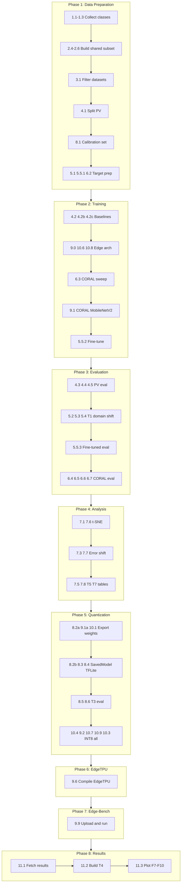

# Алгоритм работы pipeline (scripts)

Основной pipeline управляется скриптом [12.1_full_pipeline.sh](12.1_full_pipeline.sh) и содержит 8 фаз (165 шагов). Порядок запуска описан в [0.0 How to launch (recommended order).md](0.0%20How%20to%20launch%20(recommended%20order).md).

---

## Диаграмма высокого уровня (8 фаз)

---

## Потоки данных между фазами

Фазы связаны последовательно:

| Из фазы | В фазу | Поток данных |
|---------|--------|--------------|
| 1 | 2 | `configs/class_mapping_*.json`, `splits/{strategy}/pv_*.csv`, `target_*.csv` |
| 2 | 3 | `models/*.pt` (checkpoints) |
| 3 | 4 | `results/baseline_*.csv`, `results/T1_*.csv`, `results/T2_*.csv` |
| 2 | 4 | Модели для feature extraction (t-SNE) |
| 2 | 5 | `models/*.pt` для экспорта весов |
| 1 | 5 | `splits/pv_calib_10pct.csv` для PTQ |
| 5 | 6 | `export/*_int8_ptq_*.tflite` |
| 6 | 7 | `export/edgetpu/*_edgetpu.tflite` |
| 7 | 8 | Сырые результаты бенчмарков на Edge-Bench сервере |

---

## Детализация по фазам

### Phase 1: Подготовка данных (~30 сек)

| Блок | Скрипты | Вход | Выход |
|------|---------|------|-------|
| Сбор классов | 1.1, 1.2, 1.3 | datasets | classes_pv.txt, classes_plantdoc.txt, classes_fcdd.txt |
| Shared label space | 2.4, 2.5, 2.6 | classes_*.txt | class_mapping_{Fuzzy,sbert,hybrid}.json |
| Фильтрация | 3.1 | mapping | filtered datasets |
| Сплиты PV | 4.1 | filtered | splits/{strat}/pv_{train,val,test}.csv |
| Калибровка | 8.1 | splits | pv_calib_10pct.csv |
| Target (PlantDoc) | 5.1, 5.5.1, 6.2 | mapping | target_{test,train,val,unlabeled}.csv |

### Phase 2: Обучение (GPU, часы)

5 архитектур x 3 стратегии = 15 baseline моделей + CORAL + fine-tune.

| Блок | Скрипты | Модели |
|------|---------|--------|
| Baselines | 4.2, 4.2b, 4.2c | ResNet-50, EfficientNet-B3, MobileNet baseline |
| Edge arch | 9.0, 10.6, 10.8 | MobileNetV2, MobileNetV1, EfficientNet-Lite0 |
| CORAL | 6.3, 9.1 | ResNet-50 (lambda sweep), MobileNetV2 |
| Fine-tune | 5.5.2 | ResNet-50 на target |

### Phase 3: Оценка (GPU)

| Блок | Скрипты | Артефакты |
|------|---------|-----------|
| PV baselines | 4.3, 4.4, 4.5 | baseline_pv_metrics.csv, confusion matrices |
| Domain shift | 5.2, 5.3, 5.4 | T1_domain_shift.csv (ResNet-50, EfficientNet, MobileNet) |
| Fine-tuned eval | 5.5.3 | метрики fine-tuned |
| CORAL + stats | 6.4, 6.5, 6.6, 6.7 | T2, T5, F2 |

### Phase 4: Анализ и визуализация

| Блок | Скрипты | Артефакты |
|------|---------|-----------|
| t-SNE | 7.1, 7.6 | F3_tsne_*.png |
| Error/per-class | 7.3, 7.7 | T6 per-class F1 |
| Tables | 7.5, 7.8 | T7 SOTA, T5 ablation |

### Phase 5: Квантизация и TFLite экспорт (CPU)

PyTorch -> Keras -> SavedModel -> FP32 TFLite -> INT8 PTQ TFLite.

| Блок | Скрипты | Выход |
|------|---------|-------|
| Export weights | 8.2a, 9.1a, 10.1 | *.npz |
| SavedModel + TFLite | 8.2b, 8.3, 8.4 | SavedModel, FP32, INT8 |
| T3 eval | 8.5, 8.6 | T3, F4 |
| INT8 EdgeTPU-ready | 10.4, 9.2, 10.7, 10.9, 10.3 | *_int8_ptq_*.tflite |

### Phase 6–8: Edge deploy

| Фаза | Скрипты | Артефакты |
|------|---------|-----------|
| 6 | 9.6 | *_edgetpu.tflite |
| 7 | 9.9 | Edge-Bench experiments |
| 8 | 11.1, 11.2, 11.3 | T4, F7–F10 |

---

## Вспомогательные скрипты (вне main pipeline)

- **2.1, 2.2, 2.3** — normalize, normalize_classes, build_mapping (утилиты, не вызываются в 12.1)
- **10.0** — альтернативный build EfficientNet + ResNet50 TFLite
- **12.0** — rebuild exports (исправления TFLite)

---

## план: что за чем происходит

Ниже схема pipeline без технических имён файлов — только содержание шагов.

```mermaid
flowchart TB
    subgraph P1 [1. Подготовка данных]
        direction TB
        A1[Собираем классы болезней из трёх датасетов]
        A2[Строим общее пространство меток тремя способами]
        A3[Фильтруем датасеты по выбранному маппингу]
        A4[Делим исходные данные на train/val/test]
        A5[Готовим калибровочную выборку для квантизации]
        A6[Готовим целевой датасет PlantDoc]
        A1 --> A2 --> A3 --> A4 --> A5 --> A6
    end

    subgraph P2 [2. Обучение моделей]
        direction TB
        B1[Обучаем базовые модели на исходных данных]
        B2[Обучаем лёгкие модели для устройств]
        B3[Обучаем CORAL с разными lambda]
        B4[Обучаем CORAL MobileNetV2]
        B5[Дообучаем модель на целевом датасете]
        B1 --> B2 --> B3 --> B4 --> B5
    end

    subgraph P3 [3. Оценка]
        direction TB
        C1[Оцениваем базовые модели на исходных данных]
        C2[Проверяем перенос на PlantDoc без дообучения]
        C3[Оцениваем дообученную модель]
        C4[Оцениваем CORAL и строим таблицы]
        C1 --> C2 --> C3 --> C4
    end

    subgraph P4 [4. Анализ]
        direction TB
        D1[Извлекаем признаки и строим t-SNE]
        D2[Анализируем типы ошибок и F1 по классам]
        D3[Собираем итоговые таблицы сравнения]
        D1 --> D2 --> D3
    end

    subgraph P5 [5. Квантизация]
        direction TB
        E1[Экспортируем веса моделей]
        E2[Собираем SavedModel и TFLite FP32/INT8]
        E3[Оцениваем точность после квантизации]
        E4[Готовим INT8 модели для EdgeTPU]
        E1 --> E2 --> E3 --> E4
    end

    subgraph P6 [6. Компиляция EdgeTPU]
        F1[Компилируем модели под Coral EdgeTPU]
    end

    subgraph P7 [7. Бенчмарки на устройстве]
        G1[Загружаем модели на сервер Edge-Bench]
        G2[Запускаем бенчмарки на Raspberry Pi]
        G1 --> G2
    end

    subgraph P8 [8. Результаты]
        direction TB
        H1[Скачиваем результаты]
        H2[Собираем таблицу Edge-бенчмарков]
        H3[Строим графики latency и throughput]
        H1 --> H2 --> H3
    end

    P1 --> P2 --> P3 --> P4 --> P5 --> P6 --> P7 --> P8
```

### Краткое описание шагов

| # | Фаза | Что происходит |
|---|------|----------------|
| 1 | Подготовка данных | Собираем классы из PV, PlantDoc, FCDD. Строим общее пространство меток (Fuzzy, SBERT, Hybrid). Фильтруем датасеты, делим на train/val/test, готовим PlantDoc и калибровку. |
| 2 | Обучение | Обучаем ResNet-50, EfficientNet, MobileNet (базовые и edge). Обучаем CORAL для domain adaptation. Дообучаем на PlantDoc. |
| 3 | Оценка | Оцениваем все модели на исходных данных и на PlantDoc. Строим таблицы domain shift и CORAL sweep. |
| 4 | Анализ | t-SNE визуализация, анализ ошибок, per-class F1, итоговые таблицы SOTA и ablation. |
| 5 | Квантизация | Экспортируем модели в TFLite FP32/INT8. Оцениваем точность. Готовим модели для EdgeTPU. |
| 6 | EdgeTPU | Компилируем TFLite под Coral EdgeTPU. |
| 7 | Edge-Bench | Загружаем модели на сервер, деплоим на Raspberry Pi, запускаем бенчмарки. |
| 8 | Результаты | Скачиваем результаты, строим таблицы и графики latency/throughput. |
